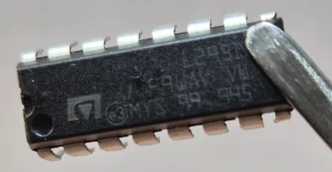

# L293D-Motor-Driver---Arduino-Module
### A simple DIY motor driver module for Arduino using the L293D IC.

A motor driver is an integrated circuit used to control motors in electronics applications. It acts as an interface between a microcontroller (like an Arduino) and the motors, controlling their speed and direction. The most common and popular IC's are from the L293 series, such as L293B, L293D, L293NE, etc. These IC's are designed to control 2 DC motors simultaneously. We will be speaking off the L293D IC only. The L293D has 16 pins and consists of two H-bridge. An H-bridge is the simplest circuit for controlling a low-current rated motor.

## SUPPLIES

  

- Perf Board (or any type of project board)
- L293D IC
- 16-pin IC socket
- 4x 1uF capacitors
- 1x 1uf capacitor
- 4x 220Ω
- 2x 5mm 2V LED
- 8x header female pins
- 3x 2 pins screw connector
- Arduino (Any) to test the Driver
- Computer with Arduino IDE installed- 
- Various items: soldering iron, solder- , wires (both solid and flexible), pliers, etc.
- 4x M3 screws - 3D printed case (optional)

## STEP 1 - CIRCUIT DESIIGN

