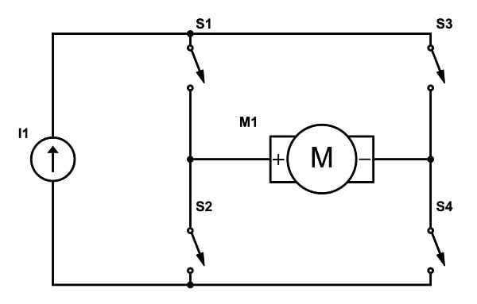

# L293D-Motor-Driver---Arduino-Module
### A simple DIY motor driver module for Arduino using the L293D IC.

A motor driver is an integrated circuit used to control motors in electronics applications. It acts as an interface between a microcontroller (like an Arduino) and the motors, controlling their speed and direction. The most common and popular IC's are from the L293 series, such as L293B, L293D, L293NE, etc. These IC's are designed to control 2 DC motors simultaneously. We will be speaking off the L293D IC only. The L293D has 16 pins and consists of two H-bridge. An H-bridge is the simplest circuit for controlling a low-current rated motor.

## SUPPLIES

    

- Perf Board (or any type of project board)
- L293D IC
- 16-pin IC socket
- 4x 1uF capacitors
- 1x 1uf capacitor
- 4x 220Ω
- 2x 5mm 2V LED
- 8x header female pins
- 3x 2 pins screw connector
- Arduino (Any) to test the Driver
- Computer with Arduino IDE installed- 
- Various items: soldering iron, solder- , wires (both solid and flexible), pliers, etc.
- 4x M3 screws - 3D printed case (optional)

## STEP 1 - CIRCUIT DESIIGN

### How the circuit works

besides being a simple circuit, it took a long time to design and test it, so I created a schematic to explain how it works.

- Enable 1is connected to a pin of your arduino wich can output a PWM signal. By changing the value of this signal you can chose the sspeed of the first motor,
-  if don't want control the speed, just pull this pin HIGH.

- Input 1 and Input 2 are connected to a digital pin of your arduino. By setting one HIGH and the other on LOW the motor will turn in one direction,
- if do the same thing by reversing the signal (swapping HIGH and LOW) the motor will turn in the opposite direction.

- Outpt 1 and Outpu 2 are connected to the pins of the first motor passing through capacitors,
- used to filter high frequencis and courrent spike protecting the IC.

- The 4 GND pins are not only used to connect the IC to GND but also todissipate the heat that produces,
- due to the high courrent that passes throgh it.

- The VS pin is used to is used to provide power to the motors connected to the driver.

- The VSS pin is used to supply the logic voltage which powers the chip's internal logic.

- Enable 2, Input 3 and Input 4, Output 3 and Output 4work the same way as Enable 1, Input 1 and 2, Output 1 and 2 do.

- The two LEDs are used to check if the Arduino is correctly sending inputs to the L293D. The first one is connected to Input 1 and 2
- and the other one is connected to Input 3 and 4. Every onre of these inputs is connected to the LED passing through a resistor of 220Ω.

## STEP 2 - TESTING AND ASSEMBLY

  

Before placing all the components on to the board, I highly recommend to test all your components and entire circuit on a breadboard and check the datasheet of your motor driver.

Once you have done this, you can proceed by placing all the components on your board and start connecting them however you want! 
I've done this making traces with solder on the bottom side of the board and on the top side I've bent into shape some solid core wires 
and placed them as needed and it ended up resulting in a very cool design.

If you want you can check the connections and wash the board with some isopropyl alcohol to remove all the excess flux and solder.

You can also print the bottom case and attach it to the board using 4x M3 screws (the case is made for 60mmx40mm perf board).
You can find the STL file of the case here -----------> [bottom_case_60x40.stl](models/bottom_case_60x40.stl)

## STEP 3 - ATDUINO CODE FOR TESTING

You can find here some Arduino code i wrote for testing your modulo -------> [src/motore.ino](src/motor_driver.ino)

